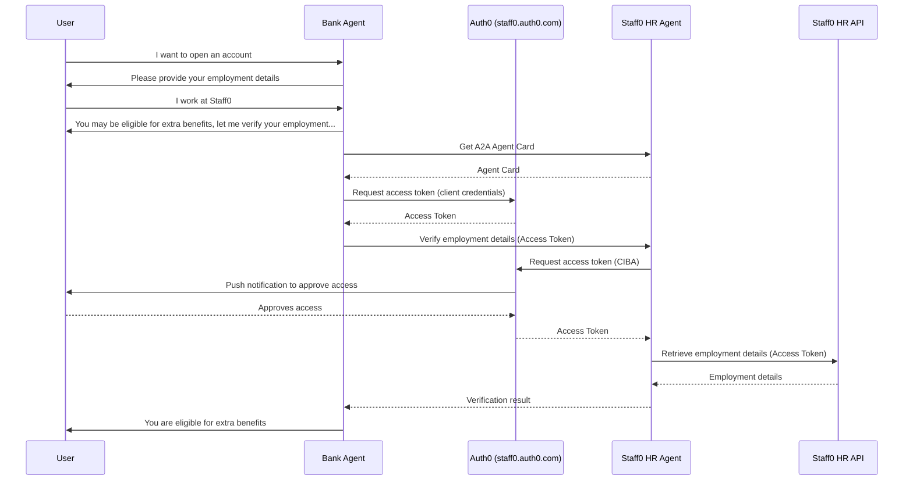

# Auth0 + Google A2A & ADK sample

## Getting Started

### Prerequisites

1. Get a [Gemini API key](https://ai.google.dev/gemini-api/docs/api-key).
2. Configure your Auth0 tenant with the following:

- APIs
  - HR API
    - Audience: `https://staff0/`
    - Permissions: `read:employee`
  - HR Agent
    - Audience: `https://staff0/agent`
- Applications
  - Bank Agent
    - Grant Types: `Client Credentials`
    - Credentials: `Private Key JWT`
    - APIs: `HR Agent`
  - HR Agent
    - Grant Types: `Client Credentials`, `Client Initiated Backchannel Authentication (CIBA)`
    - APIs: `Auth0 Management API` (enabled permissions: `read:users`), `HR API` (enabled permissions: `read:employee`)
- Push Notifications using [Auth0 Guardian](https://auth0.com/docs/secure/multi-factor-authentication/auth0-guardian) must be `enabled`.
- A test user enrolled in Guardian MFA.

3. Install [Python](https://www.python.org/downloads/) 3.11 or higher.

4. Install [Poetry](https://python-poetry.org/):

```shell
pipx install poetry
```

5. Install [Google ADK](https://google.github.io/adk-docs/):

```shell
pipx install google-adk
```

6. Install [Docker](https://docs.docker.com/engine/install/)

### Setup

Copy the `.env.example` file to `.env` and fill in the required variables.

### How to run it

1.  **Install Dependencies**

```shell
poetry install
```

2.  **Run HR Agent, HR API and Bank Agent**

```shell
make run
```

3.  **Open the Bank Agent Chatbot by navigating to [http://localhost:8000/dev-ui?app=bank_agent](http://localhost:8000/dev-ui?app=bank_agent)**

## How it works



---

<p align="center">
  <picture>
    <source media="(prefers-color-scheme: light)" srcset="https://cdn.auth0.com/website/sdks/logos/auth0_light_mode.png"   width="150">
    <source media="(prefers-color-scheme: dark)" srcset="https://cdn.auth0.com/website/sdks/logos/auth0_dark_mode.png" width="150">
    
  </picture>
</p>
<p align="center">Auth0 is an easy to implement, adaptable authentication and authorization platform. To learn more checkout <a href="https://auth0.com/why-auth0">Why Auth0?</a></p>
<p align="center">
This project is licensed under the Apache 2.0 license. See the <a href="/LICENSE"> LICENSE</a> file for more info.</p>
