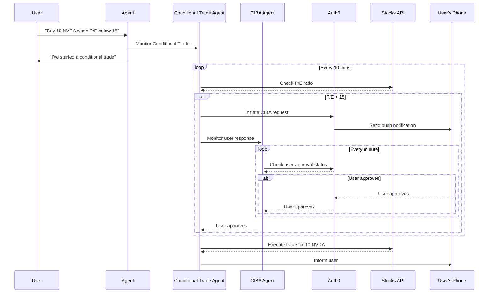

# Async Authorization Confirmation with LangChain

## Getting Started

### Prerequisites

- An OpenAI account and API key create one [here](https://platform.openai.com).
  - [Use this page for instructions on how to find your OpenAI API key](https://help.openai.com/en/articles/4936850-where-do-i-find-my-openai-api-key).
- [LangGraph CLI](https://langchain-ai.github.io/langgraph/cloud/reference/cli/)
- An [Auth0](https://manage.auth0.com/) account with the following configuration:
  - An API with the audience set to `sample-api` and `stock:trade` as a supported permission (scope).
  - A Web Application client with `CIBA grant type` enabled.
  - `Push Notifications using Auth0 Guardian` enabled.
  - A test user enrolled in Guardian.

### Setup

Create a `.env` file using the format below:

```sh
# Auth0
AUTH0_DOMAIN="<auth0-domain>"
AUTH0_CLIENT_ID="<auth0-client-id>"
AUTH0_CLIENT_SECRET="<auth0-client-secret>"

# API
API_URL=http://localhost:8081/
AUDIENCE=sample-api
REQUESTED_EXPIRY=300

# OpenAI
OPENAI_API_KEY="<openai-api-key>"

# Langchain
LANGGRAPH_API_URL="http://localhost:54367"
```

### How to run it

1.  **Install Dependencies**

    Use [Poetry](https://python-poetry.org/) to install the required dependencies:

    ```sh
    poetry install
    ```

2.  **Run Stock Trading API**

    ```sh
    poetry run api
    ```

3.  **Run Scheduler**

    ```sh
    poetry run scheduler
    ```

    > A demo scheduler that works similar to [LangGraph Cron Jobs](https://langchain-ai.github.io/langgraph/cloud/how-tos/cron_jobs/).

4.  **Run LangGraph (dev mode)**

    ```sh
    poetry run langgraph_up
    ```

    > The LangGraph server that runs the graphs.

5.  **Run GraphResumer**

    ```sh
    poetry run resumer
    ```

    > A service that resumes CIBA-interrupted threads on the LangGraph server.

6.  **From LangChain Studio, select "agent" graph, go to Manage Assistants and create a new one with the following configuration**

    ```js
    {
        "user_id": "<auth0-user-id-enrolled-in-guardian>"
    }
    ```

7.  **Submit a proper message to start the flow, for example:**

    ```
    Buy 10 NVDA when P/E below 15
    ```

### How this works



---

<p align="center">
  <picture>
    <source media="(prefers-color-scheme: light)" srcset="https://cdn.auth0.com/website/sdks/logos/auth0_light_mode.png"   width="150">
    <source media="(prefers-color-scheme: dark)" srcset="https://cdn.auth0.com/website/sdks/logos/auth0_dark_mode.png" width="150">
    
  </picture>
</p>
<p align="center">Auth0 is an easy to implement, adaptable authentication and authorization platform. To learn more checkout <a href="https://auth0.com/why-auth0">Why Auth0?</a></p>
<p align="center">
This project is licensed under the Apache 2.0 license. See the <a href="/LICENSE"> LICENSE</a> file for more info.</p>
